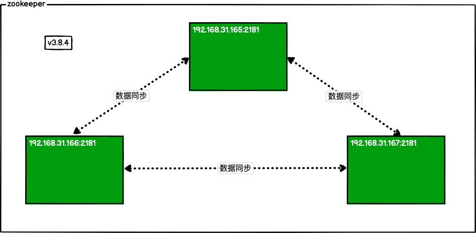

# UTMs - Manager

因开发与学习之需要，使用[UTM](https://getutm.app)搭建自己的Linux集群，并使用[RedHat - Ansible](https://www.ansible.com/)管理。

## 如何使用

```bash
make usage
```

## 操作系统

* 主控机: MacOS (arm64)
* 受控机: Ubuntu-24.04 LTS (arm64)

## 组件说明

#### Redis


#### etcd


#### zookeeper


## 许可证

* [Apache-2.0](./LICENSE.txt)
