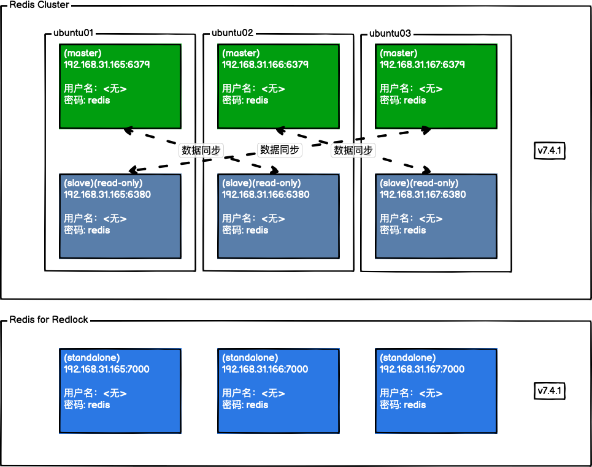

# UTMs - Manager

因开发与学习之需要，使用[UTM](https://getutm.app)搭建自己的Linux集群。

### 如何使用

```bash
make usage
```

### 操作系统

* Linux: ubuntu-24.04.1-live-server-arm64

### 组件说明

#### Reis



### 许可证

* [Apache-2.0](./LICENSE.txt)
